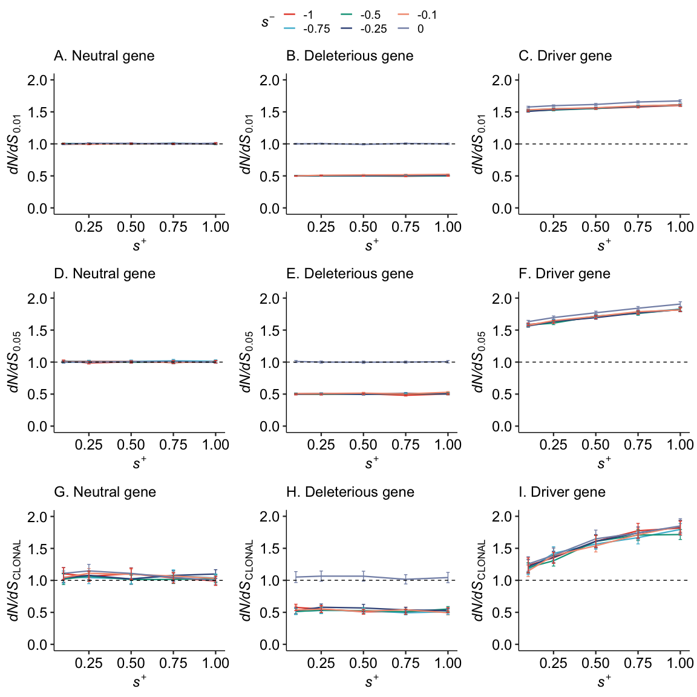
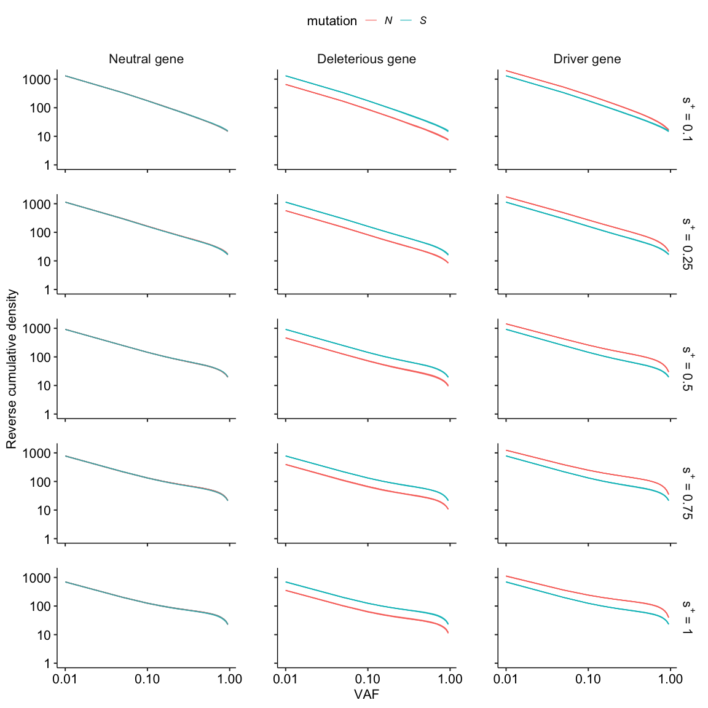
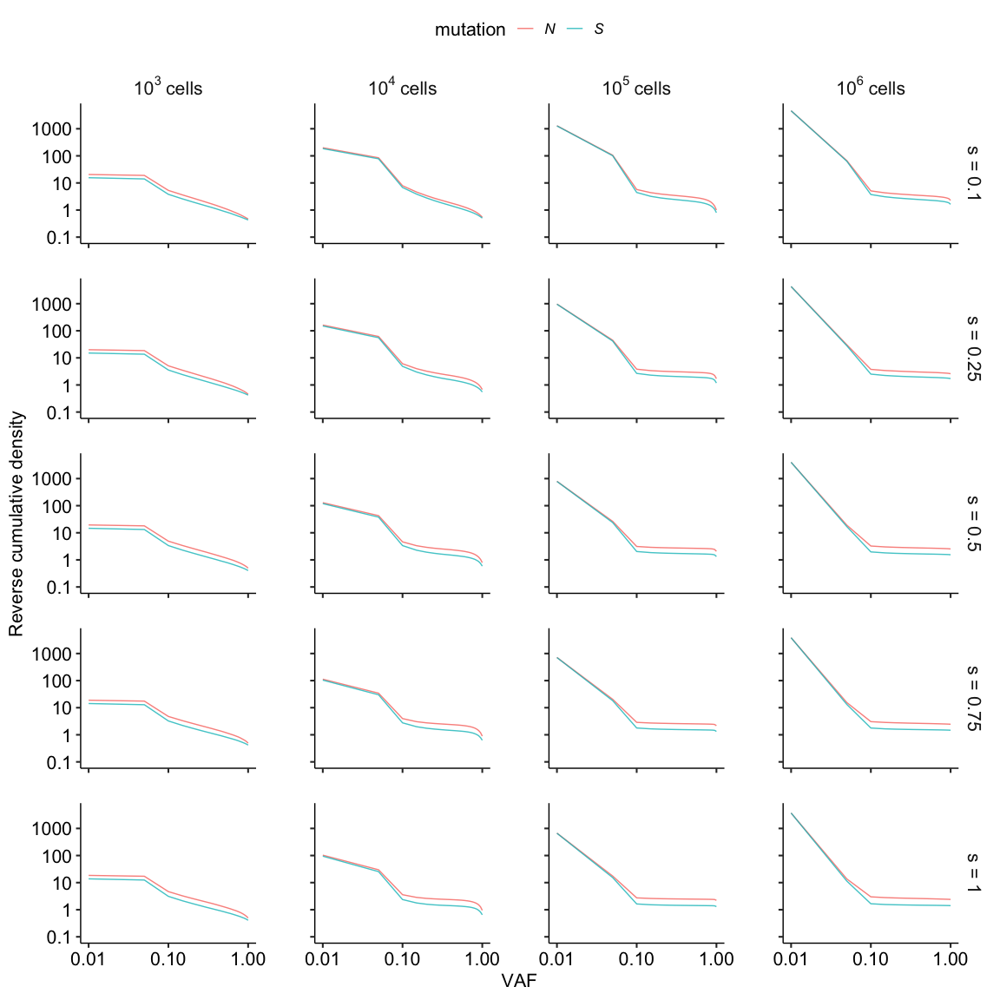

Figures: Using dN/dS to measure selection strength in cancer
================

``` r
library(tidyverse, quietly = T, warn.conflicts = FALSE)
library(data.table)
library(extrafont)
library(gridExtra)
library(latex2exp)
knitr::opts_chunk$set(message = FALSE, warning=FALSE, cache = FALSE,
                      fig.path="figures/", dev=c('png', 'pdf'),
                      echo = TRUE, fig.height = 12, fig.width = 16)
knitr::opts_knit$set(eval.after = "fig.cap")
caption <- "generic caption"
```

This report reproduces the figures in the manuscript

## Figure 1

``` r
files2 <- list.files(path = here::here("results"), pattern = "^pos_.*_neg_.*\\.freqs\\.csv", full.names = T)
```

``` r
  get_cohort_distr <- function(dt, bins) {
    N_driver <-
      apply(dt[, 1:5000], 1, function(x) {
        x %>% as.numeric %>% cut(bins) %>% table %>% as.numeric
      }) %>% t %>% colSums
    S_driver <-
      apply(dt[, 5001:10000], 1, function(x) {
        x %>% as.numeric %>% cut(bins) %>% table %>% as.numeric
      }) %>% t %>% colSums
    N_del <-
      apply(dt[, 10001:15000], 1, function(x) {
        x %>% as.numeric %>% cut(bins) %>% table %>% as.numeric
      }) %>% t %>% colSums
    S_del <-
      apply(dt[, 15001:20000], 1, function(x) {
        x %>% as.numeric %>% cut(bins) %>% table %>% as.numeric
      }) %>% t %>% colSums
    N_neu <-
      apply(dt[, 20001:25000], 1, function(x) {
        x %>% as.numeric %>% cut(bins) %>% table %>% as.numeric
      }) %>% t %>% colSums
    S_neu <-
      apply(dt[, 25001:30000], 1, function(x) {
        x %>% as.numeric %>% cut(bins) %>% table %>% as.numeric
      }) %>% t %>% colSums
    data.table(bin=bins[1:21],
               N_driver, 
               S_driver, 
               N_del, 
               S_del,
               N_neu, 
               S_neu,
               dnds_driver = rev(cumsum(rev(N_driver))) / rev(cumsum(rev(S_driver))),
               dnds_del = rev(cumsum(rev(N_del))) / rev(cumsum(rev(S_del))),
               dnds_neu = rev(cumsum(rev(N_neu))) / rev(cumsum(rev(S_neu)))
    )
  }
```

``` r
extract_pnps_from_freqs <- function(filename){
  freqs <- fread(filename) 
  cohort_size <- 100
  bins <- c(0,0.01,seq(0.05,1,by=0.05))
  
  colnames(freqs) <- c( 
                     rep("driver_N",5000), rep("driver_S",5000),
                     rep("deleterious_N",5000), rep("deleterious_S",5000),
                     rep("neutral_N",5000), rep("neutral_S",5000), "id",
                     "s_pos", "s_neg", "kk1","kk2","kk3","kk4")
  freqs[,c("id","kk1","kk2","kk3","kk4") := NULL]

  freqs[, rep := 1:.N, by=c("s_pos","s_neg")]
  freqs[,cohort := ceiling(rep/cohort_size)]

  freqs[, get_cohort_distr(.SD, bins), by=c("s_pos","s_neg","cohort")]
  

}
```

``` r
### VERY SLOW
three_genes_table <- NULL 

for(f in files2){
  cat(f)
  cat('\n')
  three_genes_table <- rbind(three_genes_table, extract_pnps_from_freqs(f))
  
}
write_csv(three_genes_table, here::here("three_genes_table.csv"))
```

``` r
three_genes_table <- fread(here::here("three_genes_table.csv"))
```

``` r
ind_plot <- function(X,y1=0,y2=2, tit, lab){
  X %>%
    ggplot(aes(x=s_pos, color=as.factor(s_neg)))+
      geom_line(aes(y=mean), lwd=0.8) +
      geom_errorbar(aes(ymin=mean-se,ymax=mean+se), width=0.02) +
      ggsci::scale_color_npg() +
      ggpubr::theme_pubr(base_size = 18)+
      geom_hline(yintercept = 1, lty="dashed") +
      labs(y=TeX(lab), x=TeX("$\\textit{s^+}$}"), color=TeX("      $\\textit{s^-}$"), title=tit) +
      ylim(c(y1,y2))+
      #theme(axis.text.x = element_text(angle = 45, vjust = 1, hjust = 1)) +
      theme(plot.title = element_text(face = "bold", size=18))
  
  
}
```

``` r
f1 <- three_genes_table[bin=='0.01',.(mean=mean(dnds_driver, na.rm = T),se=2*sd(dnds_driver, na.rm = T)/sqrt(.N)),by=c("s_pos","s_neg")] %>% ind_plot(y1=0,y2=2, TeX( 'C. Driver gene'), lab='$\\textit{dN/dS}_{0.01}$')
f3 <- three_genes_table[bin=='0.01',.(mean=mean(dnds_neu, na.rm = T),se=2*sd(dnds_neu, na.rm = T)/sqrt(.N)),by=c("s_pos","s_neg")] %>% ind_plot(y1=0,y2=2,  TeX( 'A. Neutral gene'), lab='$\\textit{dN/dS}_{0.01}$')
f2 <- three_genes_table[bin=='0.01',.(mean=mean(dnds_del, na.rm = T),se=2*sd(dnds_del, na.rm = T)/sqrt(.N)),by=c("s_pos","s_neg")] %>% ind_plot(y1=0,y2=2, TeX( 'B. Deleterious gene'), lab='$\\textit{dN/dS}_{0.01}$')
f4 <- three_genes_table[bin=='0.05',.(mean=mean(dnds_driver, na.rm = T),se=2*sd(dnds_driver, na.rm = T)/sqrt(.N)),by=c("s_pos","s_neg")] %>% ind_plot(y1=0,y2=2, TeX( 'F. Driver gene'), lab='$\\textit{dN/dS}_{0.05}$')
f5 <- three_genes_table[bin=='0.05',.(mean=mean(dnds_neu, na.rm = T),se=2*sd(dnds_neu, na.rm = T)/sqrt(.N)),by=c("s_pos","s_neg")] %>% ind_plot(y1=0,y2=2,  TeX( 'D. Neutral gene'), lab='$\\textit{dN/dS}_{0.05}$')
f6 <- three_genes_table[bin=='0.05',.(mean=mean(dnds_del, na.rm = T),se=2*sd(dnds_del, na.rm = T)/sqrt(.N)),by=c("s_pos","s_neg")] %>% ind_plot(y1=0,y2=2, TeX( 'E. Deleterious gene'), lab='$\\textit{dN/dS}_{0.05}$')
f7 <- three_genes_table[bin=='0.95',.(mean=mean(dnds_driver, na.rm = T),se=2*sd(dnds_driver, na.rm = T)/sqrt(.N)),by=c("s_pos","s_neg")] %>% ind_plot(y1=0,y2=2, TeX( 'I. Driver gene'), lab='$\\textit{dN/dS}_{CLONAL}$')
f8 <- three_genes_table[bin=='0.95',.(mean=mean(dnds_neu, na.rm = T),se=2*sd(dnds_neu, na.rm = T)/sqrt(.N)),by=c("s_pos","s_neg")] %>% ind_plot(y1=0,y2=2, TeX( 'G. Neutral gene'), lab='$\\textit{dN/dS}_{CLONAL}$')
f9 <- three_genes_table[bin=='0.95',.(mean=mean(dnds_del, na.rm = T),se=2*sd(dnds_del, na.rm = T)/sqrt(.N)),by=c("s_pos","s_neg")] %>% ind_plot(y1=0,y2=2, TeX( 'H. Deleterious gene'), lab='$\\textit{dN/dS}_{CLONAL}$')

ggpubr::ggarrange(f3, f2, f1, f5,f6, f4, f8,f9,f7,  
                  nrow = 3, ncol=3, common.legend = TRUE, heights = c(4,4,4)
                 )
```

<!-- -->

## Figure 2. VAF Distributions

``` r
three_genes_vaf_table <- three_genes_table[,lapply(.SD, mean), by=c("s_pos","s_neg","bin")][,1:10] %>%  melt.data.table(measure.vars = patterns("._driver","._del","._neu"),variable.name = "mutation",value.name = c("driver","deleterious","neutral")) %>% 
  melt.data.table(measure.vars = c("driver","deleterious","neutral"), variable.name = "gene") %>% .[,-4]

levels(three_genes_vaf_table$mutation) <- c("N","S")
```

``` r
three_genes_vaf_table$s_pos_exp <- factor(three_genes_vaf_table$s_pos, levels=c("0.1","0.25","0.5","0.75","1"), labels=c(expression(paste("s"^"+"," = 0.1")),expression(paste("s"^"+"," = 0.25")),expression(paste("s"^"+"," = 0.5")),expression(paste("s"^"+"," = 0.75")),expression(paste("s"^"+"," = 1"))))

three_genes_vaf_table$gene_exp <- factor(three_genes_vaf_table$gene, levels = c("neutral","deleterious","driver"), labels = c("Neutral gene","Deleterious gene","Driver gene")) 

single_dist_plot <- function(dt, threshold=0.01){
  dt[order(s_pos,-s_neg, gene, mutation, -bin), cumdist := cumsum(value), by=c("s_pos","s_neg", "mutation","gene")][
    bin >= threshold] %>%
    ggplot() +
      geom_line(aes(x=bin,y=cumdist, color=mutation, group= interaction(mutation, s_neg)), alpha=0.8)+
      coord_cartesian( ylim=c(1,1500))+
      scale_y_log10() +
    scale_x_log10() +
      geom_vline(xintercept = 0.01, lty="dashed", color="gray50", alpha=0.7) +
      geom_vline(xintercept = 0.05, lty="dashed", color="gray50", alpha=0.7) +
      geom_vline(xintercept = 0.95, lty="dashed", color="gray50", alpha=0.7) +
      lemon::facet_rep_grid(s_pos_exp ~ gene_exp, labeller = labeller(s_pos_exp=label_parsed), scales='free')+
      #ggpubr::theme_pubr(base_size = 14) +
     # geom_text(aes(x=0.5,y=Inf, label=paste(s_pos," ",s_neg, "   gene:",gene)), vjust=1) +
      #labs(subtitle =  paste(s_pos," ",s_neg, "   gene:",gene)) +
      #scale_x_continuous(breaks = c(seq(0.05,0.95, by = 0.15)))+
      ggpubr::theme_pubr(base_size = 16) +
      #theme(axis.text.x = element_text(angle = 0, vjust = 1, hjust = 1, size= 12)) +
      theme(legend.text = element_text(face = "italic")) +
      theme(strip.background = element_blank(), strip.text = element_text(size=16))+
      labs( x="VAF", fill="mutation", y="Reverse cumulative density")+
      NULL
}
three_genes_vaf_table[s_neg < 0] %>% 
  single_dist_plot()
```

<!-- -->

# Figure 3

``` r
# New loading routine
cohort_size <- 100 

files <- c(list.files(path = here::here("results"), pattern = "^s_pos.*[3-6].freqs\\.csv", full.names = T),
           list.files(path = here::here("results"), pattern = "^s_neg.*.freqs\\.csv", full.names = T))
## Negative s files has set time in 4

get_vaf <- function(fr, nN, nS){
  fr<- as.numeric(fr)
  q <- c(0,0.001,seq(0.05,1, by=0.05))
  get_counts <- function(q){
    if (q==1) return(c(NA,NA))
    q2 = ifelse(q==0, 0.001, ifelse(q==0.001, 0.05, q+0.05))
    N  <- sum(fr[1:nN] > q & fr[1:nN] <= q2)
    S <- sum(fr[nN+1:nS] > q & fr[nN+1:nS] <= q2)
  return(c(N,S))
  }
  dist <- sapply(q,get_counts)[,1:21] %>% as.data.frame
  #colnames(dist) <- q
  dist$type <- c("N","S")
  return(dist)
}

get_dnds <- function(file, cohort_size=cohort_size){
  nSites = (count.fields(file, sep = ",")[1] - 7) /2
  freqs <- fread(file, col.names = c(rep("N",nSites), rep("S",nSites),"id", "s", rep("kk",4), "detSize"))
  s <- as.numeric(freqs[1,"s"])
  t <- log10 (as.numeric(freqs[1,"detSize"]))
  ## get vaf
  reps <- dim(freqs)[1]
  
  fdist <- apply(freqs[1:reps,1:(nSites*2)],1,get_vaf,nSites,nSites) %>% rbindlist()
  fdist <- fdist[,lapply(.SD, sum, na.rm=T), by=type] %>% melt(id.vars="type")
  fdist <- dcast(fdist, variable ~ type)[,q:=c(0.01,seq(0.05,1,by=0.05))]
  fdist[,variable:=NULL]
  fdist[order(q, decreasing = T), dnds:=cumsum(N)/cumsum(S)]
  fdist <- melt(fdist, id.vars=c("q","dnds"), measure.vars = c("N","S"), variable.name = "type", value.name = "count")
  fdist[,c("count","s","t"):=list(count/reps,s,t)]
  
  
  freqs[, rep := 1:.N, by="s"]
  freqs[,cohort := ceiling(rep/cohort_size)]
  freqs <- freqs[,.(mut= colnames(.SD), 
                    ns_0.01=sapply(.SD, function(X){sum(X>0.01)}), 
                    ns_0.05=sapply(.SD, function(X){sum(X>0.05)}), 
                    ns_0.95=sapply(.SD, function(X){sum(X>0.95)})
  ), by=cohort, .SDcols = 1:(nSites*2)]
  
  dnds <- freqs[, lapply(.SD, sum), by=c("cohort","mut")]
  dnds <- dnds[,lapply(.SD, function(X){ fifelse(X[2]>0, X[1]/X[2], NaN)}),by=cohort, .SDcols=3:5][,c("s","t") := list(s, t)]
  return(list(fdist=fdist,dnds=dnds))
}

dnds_list <- lapply(files, get_dnds, cohort_size) 
```

``` r
write_rds(x = dnds_list, file = "dnds_list")
```

``` r
dnds_list <- read_rds("dnds_list")
```

``` r
vaf_table <- dnds_list %>% lapply('[[',1) %>% rbindlist()
dnds_table <- dnds_list %>% lapply('[[',2) %>% rbindlist()
```

``` r
t_pNpS_s <- dnds_table %>%
  data.table::melt(id.vars = c("s","t"), measure = patterns("^ns_"), variable.name="mutations", value.name="pN_pS") 
setattr(t_pNpS_s[["mutations"]],"levels",c("dN/dS0.001", "dN/dS0.05", "dN/dSCLONAL"))
```

``` r
lbls <- list(TeX('$\\textit{dN/dS}_{0.01}$'), TeX('$\\textit{dN/dS}_{0.05}$'), TeX('$\\textit{dN/dS}_{CLONAL}$'))
t_pNpS_s[t==4,.(mean=mean(pN_pS, na.rm = T),se=2*sd(pN_pS, na.rm = T)/sqrt(.N)),by=c("s","t","mutations")] %>%
  ggplot() +
    geom_line(aes(x=s, y=mean, color=as.factor(mutations))) +
    geom_errorbar(aes(x=s, ymin=mean-se,ymax=mean+se, color=as.factor(mutations)) , width=0.025) +
    ggsci::scale_color_nejm(labels=lbls) +
    ggpubr::theme_pubr(base_size=20)+
    geom_hline(yintercept = 1, lty="dashed") +
    geom_vline(xintercept = 0, lty="dashed") +
    labs(y=TeX('$\\textit{dN/dS}$'), x=TeX('$\\textit{s}$'), color=TeX(' '))+
  NULL
```

<!-- -->

# Figure 4

``` r
vaf_table[order(s, type, t, -q), cumdist := cumsum(count), by=c("s","type", "t")][ s>0] %>%
  ggplot() +
    geom_line(aes(x=q,y=cumdist, color=type), alpha=0.8)+
    coord_cartesian( ylim=c(0.1,5000))+
    scale_y_log10(labels = function(x) sprintf("%g", x)) +
    scale_x_log10() +
    geom_vline(xintercept = 0.01, lty="dashed", color="gray50", alpha=0.7) +
    geom_vline(xintercept = 0.05, lty="dashed", color="gray50", alpha=0.7) +
    geom_vline(xintercept = 0.95, lty="dashed", color="gray50", alpha=0.7) +
    lemon::facet_rep_grid(s ~ t, labeller = label_bquote(cols= 10^.(t)~ "cells", rows = "s = "*.(s)), scales='free')+
    ggpubr::theme_pubr(base_size = 16) +
    theme(legend.text = element_text(face = "italic")) +
    theme(strip.background = element_blank(), strip.text = element_text(size=16))+
    labs( x="VAF", color="mutation", y="Reverse cumulative density")+
    NULL
```

<!-- -->

# Figure 5

``` r
lbls <- list(TeX('$\\textit{dN/dS}_{0.001}$'), TeX('$\\textit{dN/dS}_{0.05}$'), TeX('$\\textit{dN/dS}_{0.95}$'))

make_plotmath_labels <- function(labs){
  labs <- str_replace_all(labs, " ", "*")
  str2expression(labs)
}
t_levels <- c("10^2 cells","10^3 cells","10^4 cells","10^5 cells")
  t_plot_ind <- function(dt, tit){
    dt %>%
    ggplot() +
    geom_line(aes(x=t, y=mean, color=as.factor(s))) +
    geom_errorbar(aes(x=t, ymin=mean-se,ymax=mean+se, color=as.factor(s)) , width=0.05) +
    ggsci::scale_color_nejm() +
    ggpubr::theme_pubr(base_size=16)+
    geom_hline(yintercept = 1, lty="dashed") +
    #  scale_x_discrete(labels = make_plotmath_labels) +
    labs(y=TeX('$\\textit{dN/dS}$'), x=TeX('$10^{x} \\textit{cells}$'), color=TeX('$\\textit{s}$'), title = tit)+
  NULL
  }

 p1 <- t_pNpS_s[s>0 & mutations=="dN/dS0.001",.(mean=mean(pN_pS, na.rm = T),se=2*sd(pN_pS, na.rm = T)/sqrt(.N)),by=c("s","t","mutations")] %>% 
   t_plot_ind(tit=TeX('A. $\\textit{dN/dS}_{0.001}$'))
  p2 <- t_pNpS_s[s>0 & mutations=="dN/dS0.05",.(mean=mean(pN_pS, na.rm = T),se=2*sd(pN_pS, na.rm = T)/sqrt(.N)),by=c("s","t","mutations")] %>% 
   t_plot_ind(tit=TeX('B. $\\textit{dN/dS}_{0.05}$'))
   p3 <- t_pNpS_s[s>0 & mutations=="dN/dSCLONAL",.(mean=mean(pN_pS, na.rm = T),se=2*sd(pN_pS, na.rm = T)/sqrt(.N)),by=c("s","t","mutations")] %>% 
   t_plot_ind(tit=TeX('C. $\\textit{dN/dS}_{CLONAL}$'))
ggpubr::ggarrange(p1,p2,p3,  
                  nrow = 1, ncol=3, common.legend = TRUE, widths = c(4,4,4)
                 )
```

<!-- -->
